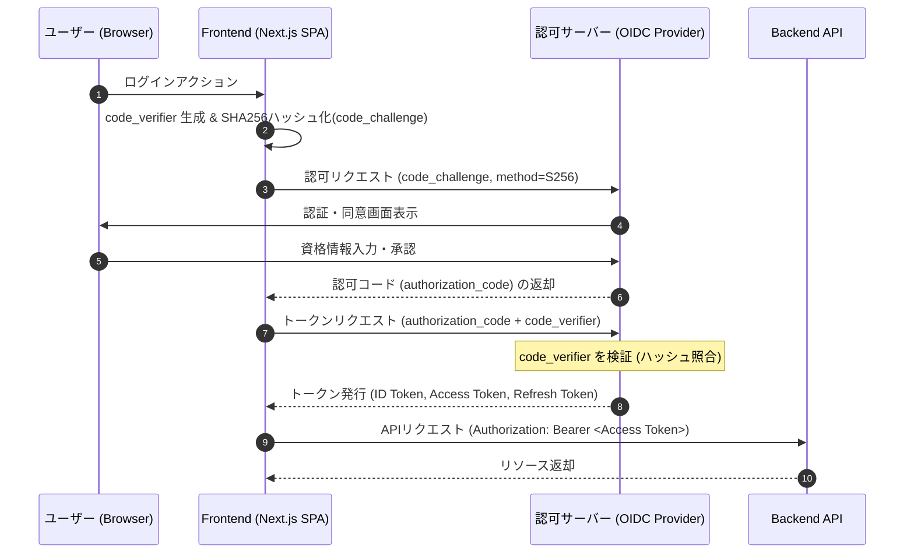

# Auth Patterns: OIDC/OAuth 2.0 for Modern Frontend

実務での開発経験に基づき、React/Next.js を用いたフロントエンド開発における認証・認可の実装パターンと、マルチベンダー環境でのセキュリティ・設計上の考慮事項を体系化しています。

---

## 1. 概要と採用アーキテクチャ

本リポジトリでは、以下の技術的課題に対するプラクティスをまとめています。

- **フロー:** Authorization Code Flow with PKCE (RFC 7636)
- **管理対象:** JWT (ID Token / Access Token) の安全なハンドリング
- **設計:** マルチベンダー開発における BE/FE インターフェースの疎結合化

### シーケンス図 (Mermaid)

