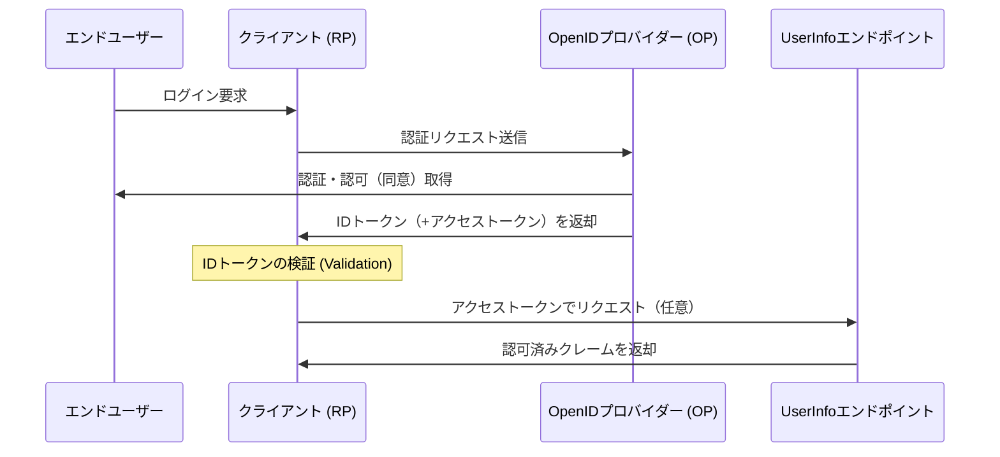

# OpenID Connect (OIDC) IDトークン仕様書 抜粋まとめ

本ドキュメントは、OpenID Connect Core 1.0 における「IDトークン」の定義、各クレームの役割、およびセキュリティ要件について、日本のWebエンジニア向けに技術背景を交えてまとめたものである。

---

## 1. 概要

OpenID Connect (OIDC) は、OAuth 2.0プロトコルの上に「アイデンティティ（身元確認）」のレイヤーを追加したものである。その中核となる拡張が **IDトークン (ID Token)** というデータ構造である。

- **役割**: エンドユーザーが認証されたという事実を証明する「セキュリティトークン」。
- **データ形式**: **JSON Web Token (JWT)** 形式で表現される。
- **主要な保証**: 認証性 (Authentication)、完全性 (Integrity)、否認防止性 (Non-repudiation)。

### OIDCの基本フロー（概念図）

## 2. IDトークンの構成要素 (Claims)

IDトークン内部に含まれる各属性情報を「クレーム (Claim)」と呼ぶ。

### 2.1 必須クレーム (REQUIRED)

すべてのフローにおいて、以下のクレームは必ず含まれていなければならない。

| クレーム名 | 名称            | 概要                                                                               |
| :--------- | :-------------- | :--------------------------------------------------------------------------------- |
| **`iss`**  | Issuer          | トークンの発行者（OP）を識別する一意なURL。https必須。クエリやフラグメントは不可。 |
| **`sub`**  | Subject         | 発行者内で一意かつ不変なユーザー識別子。255 ASCII文字以内。                        |
| **`aud`**  | Audience        | トークンの利用対象者。RPの `client_id` を含む必要がある。配列または単一文字列。    |
| **`exp`**  | Expiration Time | トークンの有効期限。これ以降、RPはトークンを拒否しなければならない。               |
| **`iat`**  | Issued At       | トークンの発行時刻。Unixタイムスタンプ（Epoch秒）形式。                            |

### 2.2 条件付き必須・任意クレーム

| クレーム名      | 名称                | 概要                                                                 |
| :-------------- | :------------------ | :------------------------------------------------------------------- |
| **`auth_time`** | Authentication Time | ユーザーが実際に認証（ログイン）した時刻。`max_age`要求時に必須。    |
| **`nonce`**     | Nonce               | リプレイアタック防止用のランダム文字列。リクエスト時と同じ値を返す。 |
| **`acr`**       | ACR                 | 認証コンテキストクラス参照。認証の「強さや質」を示す。               |
| **`amr`**       | AMR                 | 認証方式参照。具体的にどの方式（パスワード、生体等）で認証したか。   |
| **`azp`**       | Authorized Party    | トークンの発行先。特定の代理・委任シナリオ等で使用される。           |

---

## 3. 重要概念の定義

### Validation（検証）vs Verification（実証）

仕様書を読み解く上で混同しやすいが、英語では明確な使い分けがなされている。

- **Validation (検証)**: 構成物の「健全性（Soundness）」や「正しさ（Correctness）」を確立するプロセス。
  - 問い: "Are we building the thing right?"（仕様通りに作られているか？）
  - 例：署名が正しいか、有効期限が切れていないか等の「ルール適合性」チェック。
- **Verification (実証)**: 事実や値の「真実性（Truth）」や「正確性（Accuracy）」をテスト・証明するプロセス。
  - 問い: "Are we building the right thing?"（実態と一致しているか？）
  - 例：提示されたメールアドレスを本人が本当に所有しているか等の「実態」チェック。

### Essential（必須）vs Voluntary（任意）

- **Essential Claim**: 特定のタスク完了に不可欠なクレーム。欠落するとログイン等の処理が失敗する。
- **Voluntary Claim**: 有用だが、欠落しても最低限のタスク自体は継続できる（例：プロフィール画像URLなど）。

---

## 4. セキュリティ要件と実装指針

### 署名と暗号化

- **署名 (JWS)**: **必須 (MUST)**。認証性・完全性・否認防止性を保証する。
- **暗号化 (JWE)**: 任意 (OPTIONAL)。機密性を保証する。
- **順序**: 暗号化を行う場合は、必ず「**署名してから暗号化 (Sign-then-Encrypt)**」の順序で行わなければならない。その結果は **Nested JWT** と呼ばれる。

### アルゴリズム `none` の禁止

IDトークンの `alg` ヘッダーに `none`（署名なし）を使用することは、原則として**厳格に禁止 (MUST NOT)** されている。

- ※例外：認可コードフロー等で、ブラウザを介さない安全なバックチャネルから直接取得し、かつ登録時に明示的な合意がある場合のみ。

### 鍵情報の管理

- `x5u`, `x5c`, `jku`, `jwk` といったヘッダーパラメータをIDトークンに直接含めるべきではない (**SHOULD NOT**)。
- 署名検証用の公開鍵は、**Discovery (ディスカバリー)** メカニズム（`/.well-known/openid-configuration`）を用いて、事前に信頼できる経路で取得しておくべきである。

### 時計のずれ (Clock Skew)

`exp`（有効期限）の検証時、サーバー間の時刻同期の誤差を考慮し、数分程度の **許容誤差 (Leeway)** を設けることが認められている。

---

## 5. 実装時の注意点 (Implementer's Note)

- **未知のクレームの取り扱い**: 自分が理解できないクレームが含まれていた場合、エラーにせず、単に**無視しなければならない (MUST)**。これにより前方互換性が確保される。
- **セッションとの関係**: IDトークンの有効期限 (`exp`) は、RPとOP間の認証セッション（ログイン状態）の長さとは無関係である。IDトークンはあくまで「認証イベントの証明」であり、ログイン状態の維持は別途セッション管理（Cookie等）で行う。

---

© 2026 Tech Lead Notes - OIDC Specifications Series
