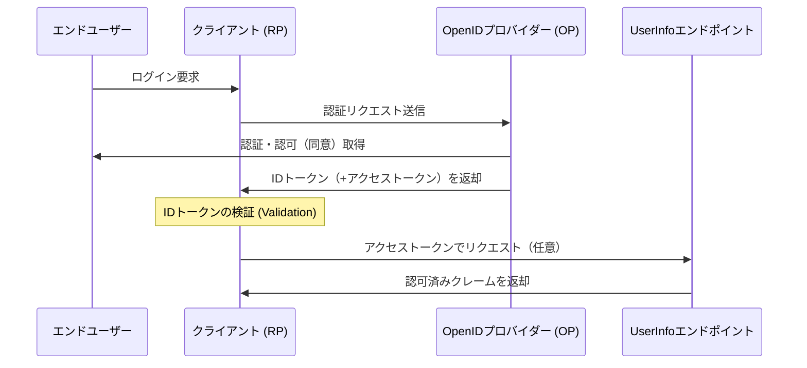

# OpenID Connect (OIDC) IDトークン仕様書 抜粋まとめ

本ドキュメントは、OpenID Connect Core 1.0 における「IDトークン」の定義、各クレームの役割、およびセキュリティ要件について、日本のWebエンジニア向けに技術背景を交えてまとめたものである。

---

## 1. 概要

OpenID Connect (OIDC) は、OAuth 2.0プロトコルの上に「アイデンティティ（身元確認）」のレイヤーを追加したものである。その中核となる拡張が **IDトークン (ID Token)** というデータ構造である。

- **役割**: エンドユーザーが認証されたという事実を証明する「セキュリティトークン」。
- **データ形式**: **JSON Web Token (JWT)** 形式で表現される。
- **主要な保証**: 認証性 (Authentication)、完全性 (Integrity)、否認防止性 (Non-repudiation)。

### OIDCの基本フロー（概念図）

## 2. IDトークンの構成要素 (Claims) と直感的理解

各クレームの厳密な定義と、理解を助ける日常的な例えをまとめます。

### 2.1 必須クレーム (REQUIRED)

すべてのフローにおいて、以下のクレームは必ず含まれていなければならない。
| クレーム名 | 名称 | 概要 | **直感的な例え** |
| :--- | :--- | :--- | :--- |
| **`iss`** | Issuer | トークンの発行者（OP）を識別する一意なURL。https必須。 | **手紙の「差出人住所」**。信頼できる相手からの手紙かを確認する。 |
| **`sub`** | Subject | 発行者内で一意かつ不変なユーザー識別子。255文字以内。 | **「社員番号」**。名前や部署が変わっても、その人自身を指し続ける背番号。 |
| **`aud`** | Audience | トークンの利用対象者（RPのclient_id）。 | **手紙の「宛名」**。自分宛てでない手紙は、たとえ中身が本物でも無視する。 |
| **`exp`** | Expiration Time | トークンの有効期限。これ以降は拒否しなければならない。 | **コンサートの「開演時刻」**。遅刻（期限切れ）したチケットは無効。 |
| **`iat`** | Issued At | JWTが発行された時刻。 | **食品の「製造年月日」**。いつ作られた「鮮度」の情報かを示す。 |

---

### 2.2 条件付き・任意クレーム

| クレーム        | 名称                | 概要                                                         | **直感的な例え**                                                             |
| :-------------- | :------------------ | :----------------------------------------------------------- | :--------------------------------------------------------------------------- |
| **`auth_time`** | Authentication Time | ユーザーが実際に認証（ログイン）を完了した時刻。             | **テーマパークの「入園ゲート通過時刻」**。アトラクション利用の制限時間管理。 |
| **`nonce`**     | Nonce               | セッションとトークンを紐付け、リプレイアタックを軽減する。   | **ピザ配達の「合言葉」**。今の注文に対する正しい配達員かを確認する。         |
| **`acr`**       | ACR                 | 認証コンテキストクラス参照。認証の「強さや質」を識別する。   | **料理の「ミシュラン格付け」**。その認証がどれほど厳格かを示す。             |
| **`amr`**       | AMR                 | 認証方式参照。パスワード、生体等、具体的な認証手段のリスト。 | **料理の「詳細な調理法」**。パスワード、指紋など具体的な手段の記録。         |
| **`azp`**       | Authorized Party    | 認可された当事者。トークンが発行されたクライアントのID。     | **ビル受付の「受領印」**。最終宛先とは別に、誰が最初に受け取ったか。         |

---

## 3. 重要概念の定義

### Validation（検証）vs Verification（実証）

仕様書を読み解く上で混同しやすいが、英語では明確な使い分けがなされている。

- **Validation (検証)**: 構成物の「健全性（Soundness）」や「正しさ（Correctness）」を確立するプロセス。
  - 問い: "Are we building the thing right?"（仕様通りに作られているか？）
  - 例：署名が正しいか、有効期限が切れていないか等の「ルール適合性」チェック。
- **Verification (実証)**: 事実や値の「真実性（Truth）」や「正確性（Accuracy）」をテスト・証明するプロセス。
  - 問い: "Are we building the right thing?"（実態と一致しているか？）
  - 例：提示されたメールアドレスを本人が本当に所有しているか等の「実態」チェック。

### Essential（必須）vs Voluntary（任意）

- **Essential Claim**: 特定のタスク完了に不可欠なクレーム。欠落するとログイン処理が即座に失敗する、クリティカルな情報。
- **Voluntary Claim**: あれば嬉しいが、なくても最低限の処理は継続できる付加情報。（例：プロフィール画像URLなど）

---

## 4. セキュリティ要件と実装指針

### 署名と暗号化

- **署名 (JWS)**: **必須 (MUST)**。認証性・完全性・否認防止性を保証する。
- **暗号化 (JWE)**: 任意 (OPTIONAL)。機密性を保証する。
- **順序**: 暗号化を行う場合は、必ず「**署名してから暗号化 (Sign-then-Encrypt)**」の順序で行わなければならない。その結果は **Nested JWT** と呼ばれる。
  - 鍵付きケース（暗号化）の外側に印を押しても、中身がすり替えられるリスクがあるため、まず中身を保証（署名）してから保護（暗号化）する必要がある。

### アルゴリズム `none` の禁止

IDトークンの `alg` ヘッダーに `none`（署名なし）を使用することは、原則として**厳格に禁止 (MUST NOT)** されている。

- ※例外：認可コードフロー等で、ブラウザを介さない安全なバックチャネルから直接取得し、かつ登録時に明示的な合意がある場合のみ。

### 鍵情報の管理

- `x5u`, `x5c`, `jku`, `jwk` といったヘッダーパラメータをIDトークンに直接含めるべきではない (**SHOULD NOT**)。
- 署名検証用の公開鍵は、**Discovery (ディスカバリー)** メカニズム（`/.well-known/openid-configuration`）を用いて、事前に信頼できる経路で取得しておくべきである。
  - 荷物に「これが私の本物の印影です」という見本（鍵）が同封されていたら、偽造し放題になってしまうため。

### 時計のずれ (Clock Skew)

`exp`（有効期限）の検証時、サーバー間の時刻同期の誤差を考慮し、数分程度の **許容誤差 (Leeway)** を設けることが認められている。

---

## 5. 概念的まとめ：パスポートのメタファー ✈️

OIDCのIDトークン仕様全体を理解する最も強力な例えは「パスポート」である。

- **パスポート本体**: IDトークン（JWT）
- **発行国（日本国）**: `iss` (Issuer)
- **旅券番号**: `sub` (Subject)
- **入国審査官**: クライアント (RP)
- **入国先の国名**: `aud` (Audience)
- **ホログラム・特殊印刷**: 署名 (JWS)。これがあるから本物だと信じられる。
- **事前の外交ルート**: Discovery。審査官が日本のパスポートの真偽判定基準をあらかじめ知っている状態。

---

## 6. 実装時の注意点 (Implementer's Note)

- **未知のクレームの取り扱い**: 理解できないクレームは**「無視しなければならない (MUST)」**。これは、外国の小包に知らない言語のメモが貼ってあっても、配達を止めてはいけないのと同じ。
- **セッション管理との分離**: IDトークンの期限が切れても、Webサイトのセッション（ログイン状態）を即座に切る必要はない。両者のライフタイムは別物として管理する。

---

© 2026 Tech Lead Notes - OIDC Specifications Series
