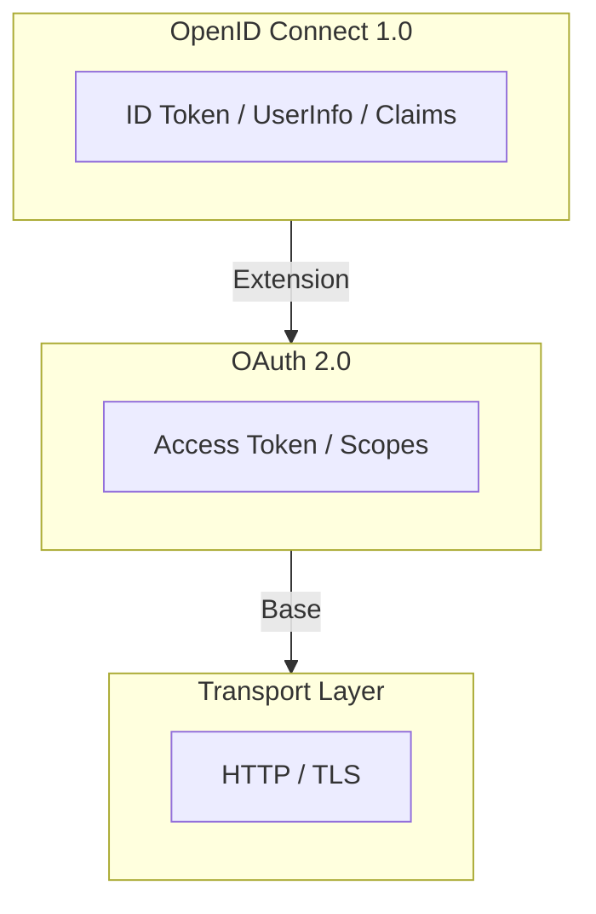
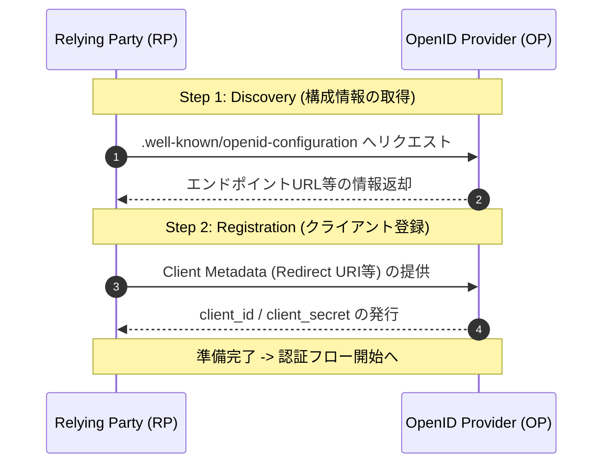

# 1. OpenID Connect 1.0 概要

OpenID Connect 1.0 (OIDC) は、OAuth 2.0 プロトコルの上に構築された、シンプルで相互運用可能な **IDレイヤー（認証レイヤー）** です。

認可のフレームワークである OAuth 2.0 を土台とすることで、セキュアなアクセス権限管理を継承しつつ、新たに「ユーザーが誰であるか」を証明する機能を付加しています。

## 主な機能

OpenID Connect の中核となる機能は、主に以下の2点に集約されます。

* **OAuth 2.0 上に構築された認証機能**
    * OAuth 2.0 の認可フローを拡張し、クライアントがエンドユーザーの身元を確認（認証）することを可能にします。これにより、認可サーバーによる認証結果に基づいた信頼性の高いログイン処理が実現されます。
* **エンドユーザーに関する情報を伝達するための「クレーム」の利用機能**
    * 「Claims（クレーム）」と呼ばれる標準化された形式（JSON）を用いて、ユーザーの名前やメールアドレスなどの属性情報を安全に伝達します。これにより、異なるシステム間でも一貫したユーザー情報のやり取りが可能になります。

---
> **Note:** OpenID Connect は、REST-like な手法により、Web、モバイル、および JavaScript クライアントといった多様なアプリケーション環境において、相互運用性の高い実装を提供します。

# 第2章：技術的背景と前提条件

## 2.1 OAuth 2.0 の限界と OIDC の役割

OpenID Connect (OIDC) を理解するためには、その土台である **OAuth 2.0 (RFC6749, RFC6750)** との役割の違いを明確にする必要があります。

* **OAuth 2.0 が提供するもの**
    * サードパーティアプリが HTTP リソースへアクセスするための「アクセストークン」の発行・利用のフレームワーク。
* **OAuth 2.0 が定義していないもの**
    * **身元情報（Identity Information）** を提供するための標準的な手法。
* **本仕様における解決策**
    * 素の OAuth 2.0 では、エンドユーザーが「いつ、どのように認証されたか」という情報を伝えることができません。
    * OIDC はその欠落したピース（認証レイヤー）を補完し、認証情報を伝達する仕組みを導入します。

> [!IMPORTANT]
> 本仕様書は、読者が RFC6749 および RFC6750 に精通していることを前提としています。

## 2.2 実装の仕組みと用語定義

### 1. 認証の有効化（トリガー）
OIDC は OAuth 2.0 の認可プロセスを拡張する形で動作します。
* クライアントが認可リクエスト（Authorization Request）の `scope` パラメータに **`openid`** という値を指定することで、OIDC の拡張機能が有効になります。

### 2. 認証情報の返却
* **IDトークン**: 実行された認証の結果は、**JWT (JSON Web Token)** 形式の「IDトークン」として返却されます。これにより、クライアントはユーザーの身元を安全に検証できます。

### 3. 登場人物の定義
OIDC の文脈では、OAuth 2.0 の各ロールを以下の別名で参照します。

| OAuth 2.0 における呼称 | OIDC における呼称 | 略称 | 役割 |
| :--- | :--- | :--- | :--- |
| **Authorization Server** | **OpenID Provider** | **OP** | ユーザーを認証し、IDトークンを発行するサーバー |
| **Client** | **Relying Party** | **RP** | 認証結果（IDトークン）を信頼して利用するアプリ |

## 2.3 事前準備（事前条件）

RP がフローを開始する前に、以下の準備が完了している必要があります。

### 1. OP 構成情報の取得
RP は OP の各エンドポイントの場所（URL）をあらかじめ把握しておく必要があります。
* **必要な情報**: 認可エンドポイント、トークンエンドポイント、およびサポート機能のリスト。
* **取得方法**: 通常は **OpenID Connect Discovery 1.0** に基づくディスカバリ機能を使用しますが、手動設定等の他手段も許容されます。

### 2. クライアント登録 (Client Registration)
RP は OP を利用するための資格情報を取得し、必要な情報を OP へ提供済みである必要があります。
* **やり取りされる情報**: `client_id` / `client_secret`（OPから発行）、および `Redirect URI`（RPから提供）。
* **登録方法**: **OpenID Connect Dynamic Client Registration 1.0** による動的登録、または管理画面等での手動登録。