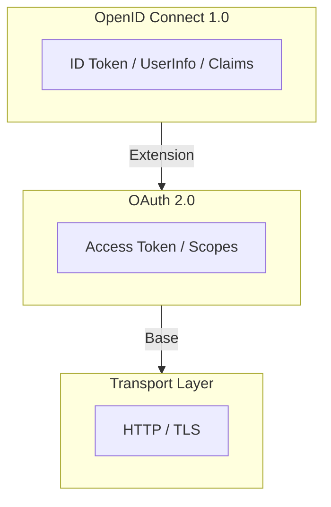
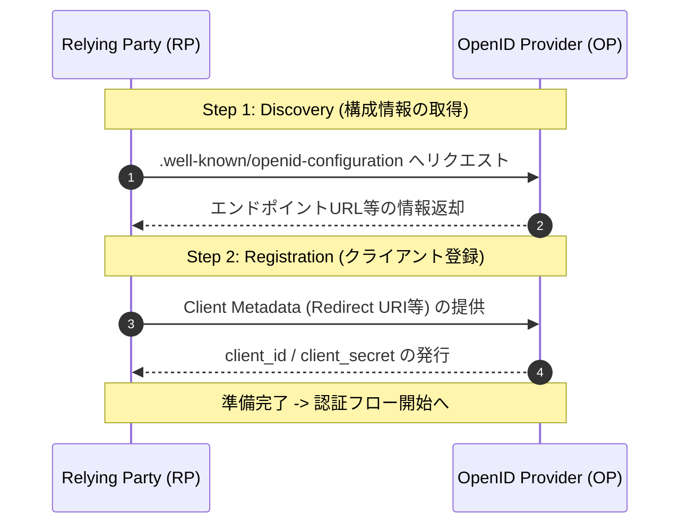

# 1. OpenID Connect 1.0 概要

OpenID Connect 1.0 (OIDC) は、OAuth 2.0 プロトコルの上に構築された、シンプルで相互運用可能な **IDレイヤー（認証レイヤー）** です。

認可のフレームワークである OAuth 2.0 を土台とすることで、セキュアなアクセス権限管理を継承しつつ、新たに「ユーザーが誰であるか」を証明する機能を付加しています。

## 主な機能

OpenID Connect の中核となる機能は、主に以下の2点に集約されます。

* **OAuth 2.0 上に構築された認証機能**
    * OAuth 2.0 の認可フローを拡張し、クライアントがエンドユーザーの身元を確認（認証）することを可能にします。これにより、認可サーバーによる認証結果に基づいた信頼性の高いログイン処理が実現されます。
* **エンドユーザーに関する情報を伝達するための「クレーム」の利用機能**
    * 「Claims（クレーム）」と呼ばれる標準化された形式（JSON）を用いて、ユーザーの名前やメールアドレスなどの属性情報を安全に伝達します。これにより、異なるシステム間でも一貫したユーザー情報のやり取りが可能になります。

---
> **Note:** OpenID Connect は、REST-like な手法により、Web、モバイル、および JavaScript クライアントといった多様なアプリケーション環境において、相互運用性の高い実装を提供します。

# 第2章：技術的背景と前提条件

## 2.1 OAuth 2.0 の限界と OIDC の役割

OpenID Connect (OIDC) を理解するためには、その土台である **OAuth 2.0 (RFC6749, RFC6750)** との役割の違いを明確にする必要があります。

* **OAuth 2.0 が提供するもの**
    * サードパーティアプリが HTTP リソースへアクセスするための「アクセストークン」の発行・利用のフレームワーク。
* **OAuth 2.0 が定義していないもの**
    * **身元情報（Identity Information）** を提供するための標準的な手法。
* **本仕様における解決策**
    * 素の OAuth 2.0 では、エンドユーザーが「いつ、どのように認証されたか」という情報を伝えることができません。
    * OIDC はその欠落したピース（認証レイヤー）を補完し、認証情報を伝達する仕組みを導入します。

> [!IMPORTANT]
> 本仕様書は、読者が RFC6749 および RFC6750 に精通していることを前提としています。

## 2.2 実装の仕組みと用語定義

### 1. 認証の有効化（トリガー）
OIDC は OAuth 2.0 の認可プロセスを拡張する形で動作します。
* クライアントが認可リクエスト（Authorization Request）の `scope` パラメータに **`openid`** という値を指定することで、OIDC の拡張機能が有効になります。

### 2. 認証情報の返却
* **IDトークン**: 実行された認証の結果は、**JWT (JSON Web Token)** 形式の「IDトークン」として返却されます。これにより、クライアントはユーザーの身元を安全に検証できます。

### 3. 登場人物の定義
OIDC の文脈では、OAuth 2.0 の各ロールを以下の別名で参照します。

| OAuth 2.0 における呼称 | OIDC における呼称 | 略称 | 役割 |
| :--- | :--- | :--- | :--- |
| **Authorization Server** | **OpenID Provider** | **OP** | ユーザーを認証し、IDトークンを発行するサーバー |
| **Client** | **Relying Party** | **RP** | 認証結果（IDトークン）を信頼して利用するアプリ |

## 2.3 事前準備（事前条件）

RP がフローを開始する前に、以下の準備が完了している必要があります。

### 1. OP 構成情報の取得
RP は OP の各エンドポイントの場所（URL）をあらかじめ把握しておく必要があります。
* **必要な情報**: 認可エンドポイント、トークンエンドポイント、およびサポート機能のリスト。
* **取得方法**: 通常は **OpenID Connect Discovery 1.0** に基づくディスカバリ機能を使用しますが、手動設定等の他手段も許容されます。

### 2. クライアント登録 (Client Registration)
RP は OP を利用するための資格情報を取得し、必要な情報を OP へ提供済みである必要があります。
* **やり取りされる情報**: `client_id` / `client_secret`（OPから発行）、および `Redirect URI`（RPから提供）。
* **登録方法**: **OpenID Connect Dynamic Client Registration 1.0** による動的登録、または管理画面等での手動登録。

## 2.4 用語の定義と参照先

本仕様書で使用される主要な用語は、以下の標準仕様に基づいています。

| 参照先仕様 | 主な定義用語 |
| :--- | :--- |
| **OAuth 2.0** | Access Token, Authorization Code, Authorization Server, Client, Grant Type, etc. |
| **JWT** | Claim Name, Claim Value, JWT Claims Set, Nested JWT, etc. |
| **JWS** | Base64url Encoding, Header Parameter, JOSE Header |
| **RFC 7230** | User Agent |
| **OAuth.Responses** | Response Mode |

> [!TIP]
> これらの用語の厳密な定義を確認したい場合は、それぞれのリンク先（RFC等）の定義セクションを参照してください。

## 2.5 独自に定義される用語

OpenID Connectでは、外部仕様の参照に加え、以下の用語を独自に定義します。

各用語には、エンジニア視点での補足情報を以下の形式で記載しています。
> [!IMPORTANT]
> **概念の核心・最重要ポイント**：認証の根幹に関わる、絶対に外せない知識です。

> [!TIP]
> **実装のヒント・実務的な知恵**：コードを書く際や設計時に役立つ具体的なアドバイスです。

> [!NOTE]
> **補足情報・豆知識**：定義をより深く理解するための背景や、関連する周辺知識です。

### 主要用語の定義

* **認証 (Authentication)**
    * エンティティ（利用者などの実体）と、提示されたアイデンティティ（ID等の身分情報）の結びつきに対して、十分な確信を得るために行われるプロセス。
    > [!IMPORTANT]
    > **💡 豆知識： Authentication vs Authorization**
    > 
    > OIDCの学習において、ここが最大の混乱ポイントです。
    > * **Authentication (認証):** 「あなたは誰？」を確認する（今回の定義）。
    > * **Authorization (認可):** 「あなたにこの操作をする権限はある？」を確認する。
    > 
    > OIDCは、OAuth 2.0（認可）の仕組みを使いながら、この **Authentication（認証）** を実現するための仕様であることを再確認しておくと、この後の読解がスムーズになります。
* **認証リクエスト (Authentication Request)**
    * OAuth 2.0 の認可リクエストをベースに、OIDC 独自の拡張パラメータとスコープ（`openid`など）を加えたもの。
    * **目的:** RP（クライアント）が、OP（認可サーバー）に対して、エンドユーザーの身元を確認（認証）するよう要求するために行われる。
    > [!IMPORTANT]
    > **💡 技術的なヒント：この定義の重要ポイント**
    >
    > この一文は、**「認証リクエストは、実は OAuth 2.0 の認可リクエストそのものである（ただし拡張されている）」**という事実を伝えています。
    >
    > 「認証リクエスト」という全く新しい仕組みをゼロから作るのではなく、既存の「認可リクエスト」に `scope=openid` などの追加情報を付け足すだけで認証を実現する、というOIDCの効率的な設計思想がここに現れています。
* **認証コンテキスト (Authentication Context)**
    * RP がアクセス許可の判断を下す際に、OP に対して要求できる追加情報。
    * **内容例:**
        * どのような認証方法（パスワード、生体認証、等）が使われたか。
        * 認証の信頼性レベル（LoA: Level of Assurance）。
    * **目的:** 単に「誰か」を知るだけでなく、「どの程度厳格に本人確認されたか」を RP が把握するために利用される。
* **認証コンテキストクラス (Authentication Context Class)**
    * 複数の認証手法（パスワード、生体認証、ワンタイムパスワード等）を、セキュリティの強度や性質に基づいて「同等なもの」としてグループ化した単位。
    * **役割:** RP は「具体的な手法（指紋か顔か）」を指定する代わりに、「このレベル（クラス）以上の認証をしてほしい」と要求することができます。
    > [!TIP]
    > **💡 技術的なヒント： 実務での活用：acr クレーム**
    >
    > 実際の OIDC の通信では、この認証コンテキストは **`acr`** というクレームとして ID トークンの中に現れます。
    >
    > エンジニアとして実装する際は、「IDトークンの中の `acr` の値を確認し、多要素認証（MFA）が完了していることを示す値が含まれていなければ、重要な操作ページへのアクセスを制限する」といった、動的なセキュリティ制御を行うために活用されます。
* **認証コンテキストクラスリファレンス (ACR: Authentication Context Class Reference)**
    * 認証コンテキストクラスを指し示すための識別子（通常は URI や特定の文字列）。
    * **実例:** IDトークン内の `acr` クレームには、`"https://refeds.org/profile/mfa"` や `"0"` (パスワード認証のみ) といった値が入ります。
    * **役割:** RP はこのリファレンスを確認することで、どのような強度の認証が行われたかを判断します。
* **認可コードフロー (Authorization Code Flow)**
    * OAuth 2.0 の主要なフローの一つ。
    * **特徴:** 1. 認可エンドポイントからまず「認可コード」を受け取る。
        2. そのコードをトークンエンドポイントへ提示し、引き換えにすべてのトークン（IDトークン、アクセストークン等）を受け取る。
    * **メリット:** ブラウザを介さずにトークンをやり取りするため、セキュリティ強度が高い。
    > [!TIP]
    > **💡 技術的なヒント： なぜ "all tokens" なのか？**
    >
    > OIDC には他にも「インプリシットフロー（Implicit Flow）」というものがあり、そちらは認可エンドポイントから直接トークンが返ってきます。
    > それと比較して、**「認可コードフローは、大事なトークン（アクセストークンやIDトークン）はすべて、より安全な『トークンエンドポイント』から出すんだよ」**と強調しているのが、この定義の一番のポイントです。
* **認可リクエスト (Authorization Request)**
    * OAuth 2.0 ([RFC6749]) によって定義されている、リソースへのアクセス権を要求する標準的なリクエスト。
* **クレーム (Claim)**
    * エンティティ（ユーザー等）に関して、発行者が「正しい」と断言（主張）する情報の一項目。
    * **例:** `name`: `Jane Doe` というペアは、「このユーザーの名前は Jane Doe である」という一つのクレームです。
    > [!TIP]
    > **💡 技術的なヒント：なぜ "Piece" なのか**
    >
    > IDトークンや UserInfo レスポンスは、全体として複数の Claims（複数形）で構成されています。
    > その中の一つひとつ（名前、メールアドレス、誕生日など）の**情報の断片**が `a Piece of information = a Claim` です。
    > 
    > パズルのピース（Claim）を組み合わせて、一つのアイデンティティ（Identity）という絵を完成させているとイメージすると分かりやすいでしょう。
* **クレームタイプ (Claim Type)**
    * クレーム値を表現するためのデータ形式。
    * **定義されている種類:**
        * **Normal:** OP が直接保持し、トークンに含める値。
        * **Aggregated:** OP が外部から収集し、署名を付与して含める値。
        * **Distributed:** 値そのものではなく、取得先エンドポイントへの参照。
* **クレームプロバイダー (Claims Provider)**
    * エンティティに関するクレームを返却する能力を持つサーバー。
    * **補足:** 通常は OpenID プロバイダー (OP) がこの役割を担いますが、外部の属性管理サーバーがこの役割を果たす場合もあります。
* **クレデンシャル / 資格情報 (Credential)**
    * 特定のアイデンティティやリソースを使用する権限があることを証明するために提示するデータ。
    * **例:** パスワード、秘密鍵（Client Secret）、アクセス許可のための証明書など。
    > [!TIP]
    > **💡 技術的なヒント： Credential と Identity**
    > 
    > 両者の違いをシンプルに表すと以下のようになります。
    > * **Identity（アイデンティティ）**: 「私は田中です」という**主張**。
    > * **Credential（クレデンシャル）**: 「田中本人であることの**証拠**（パスワードなど）」。
    > 
    > この「証拠」を提示して「主張」が正しいと認められることで、認証が完了します。
* **エンドユーザー (End-User)**
    * 一連のプロセスにおける「人間の参加者」。
    * **補足:** ソフトウェア（クライアントやサーバー）ではなく、実際に認証の対象となる生身の人間のことを指します。
    > [!TIP]
    > **💡 技術的なヒント： OIDCにおけるEnd-Userの役割**
    > 
    > OIDCのフローにおいて、エンドユーザーは主に以下の2つの重要なアクションを行います。
    > 
    > 1. **Authentication (認証)**: OPに対して自分自身の証明（パスワード入力、生体認証など）を行う。
    > 2. **Consent (同意)**: 自分の情報（名前やメールアドレスなど）を、RP（アプリ）に渡してよいか承認・同意する。
    > 
    > このように、ユーザーは単に「ログインする」だけでなく、情報の受け渡しをコントロールする主体としての役割を持っています。
* **エンティティ (Entity)**
    * 独立した個別の存在を持ち、特定の文脈において識別が可能なもの。
    * **例:** エンドユーザー（人間）はエンティティの代表的な一例ですが、文脈によってはデバイスやアプリケーション自体がエンティティとなる場合もあります。
* **不可欠なクレーム (Essential Claim)**
    * クライアント（RP）が、特定の機能を提供するために「必須である」と指定したクレーム。
    * **役割:** ユーザーに適切な認可プロセスを提供し、スムーズなサービス利用（ユーザー体験）を確保するために利用される。
* **ハイブリッドフロー (Hybrid Flow)**
    * OAuth 2.0 のフローの一つで、認可コードフローとインプリシットフローを組み合わせたもの。
    * **特徴:** * 認可エンドポイント（フロントチャネル）から、認可コードと一部のトークン（IDトークン等）を同時に取得できる。
        * その後、トークンエンドポイント（バックチャネル）から残りのトークンを取得する。
    * **メリット:** クライアントが即座にIDトークンを利用しつつ、安全に他のトークンを取得したい場合に使用される。
* **IDトークン (ID Token)**
    * 認証イベントに関する情報を格納した **JWT (JSON Web Token)**。
    * **役割:** 認証の結果として発行され、ユーザーの識別子（sub）や認証時刻（iat）などのクレームを運ぶ。
    * **拡張性:** 仕様で定められた必須クレーム以外にも、任意の追加情報を「他のクレーム」として含めることが可能です。
    > [!TIP]
    > **💡 技術的なヒント： JWTであることの意味**
    >
    > IDトークンが JWT 形式を採用していることには、技術的に大きなメリットがあります。
    >
    > 1. **Base64URLエンコード:** 特殊な文字が含まれないため、URLのパラメータやHTTPヘッダーに載せて安全に転送できます。
    > 2. **署名（JWS）:** 第三者によるデータの書き換え（改ざん）を数学的に検知できるため、受け取ったデータが本物であると確信できます。
    > 3. **JSON形式:** 多くのプログラミング言語で標準的にサポートされている形式なので、データの解析（パース）や取り扱いが容易です。
* **識別子 (Identifier)**
    * 特定の文脈（システムやドメイン等）において、あるエンティティを一意に特定・識別するための値。
    * **OIDCにおける代表例:** `sub` (Subject) クレーム。これは OP 内でエンドユーザーを一意に識別するための識別子です。
* **アイデンティティ (Identity)**
    * あるエンティティに関連付けられた「属性（Attribute）の集合」。
    * **補足:** OIDC においては、IDトークンや UserInfo レスポンスに含まれる複数のクレームの集まりが、そのユーザーのデジタルなアイデンティティとなります。
    > [!TIP]
    > **💡 技術的なヒント： なぜ「属性のセット」なのか？**
    >
    > デジタル上のアイデンティティは、必ずしも「その人のすべて」を指すわけではありません。
    > 
    > * **銀行用アイデンティティ:** 口座番号、住所、本名など
    > * **SNS用アイデンティティ:** ハンドルネーム、プロフィール画像など
    > 
    > このように、**その文脈（Context）で必要な属性のセット**が、その場でのアイデンティティとして機能します。OIDCが「Claimのセット」としてIdentityを定義しているのは、利用シーンに応じて適切な情報だけを受け渡しできるようにするためです。
* **発行者識別子 (Issuer Identifier)**
    * 発行者（OP）を一意に特定するための、検証可能な識別子。
    * **形式の制約:**
        * `https` スキームから始まる、大文字小文字を区別する URL。
        * ホスト名までは必須。ポート番号とパスは任意。
        * **注意:** クエリパラメータ（`?`）やフラグメント（`#`）を含めてはならない。
    * **役割:** IDトークンの `iss` クレームに使用され、信頼できる発行者かどうかを判断する基準となる。
    > [!TIP]
    > **💡 技術的なヒント： なぜクエリやフラグメントが禁止されているのか？**
    >
    > 発行者識別子を**「シンプルかつ一意なベースURL」**に固定するためです。
    > `?` (クエリ) や `#` (フラグメント) のような複雑なパラメータを許可してしまうと、URLの正規化（パース）処理において解釈の不一致（ミス）が起きやすくなります。
    >
    > もし解釈が異なると、IDトークンの検証時に `iss` クレームの比較に失敗したり、悪意のある攻撃者がわずかに異なるURLを使ってなりすましを行うセキュリティホールに繋がるリスクがあるため、仕様によって厳格に制限されています。
* **メッセージ (Message)**
    * OpenID リライイング・パーティ (RP) と OpenID プロバイダ (OP) の間で行われる「リクエスト」または「レスポンス」。
    > [!NOTE]
    > **💡 豆知識： 通信の基本単位**
    >
    > OIDCのやり取りは、この「メッセージ」を積み重ねることで成立します。例えば、RPからOPへの「認証リクエスト」というメッセージに対し、OPからRPへ「認証レスポンス」というメッセージが返される、といった具合です。